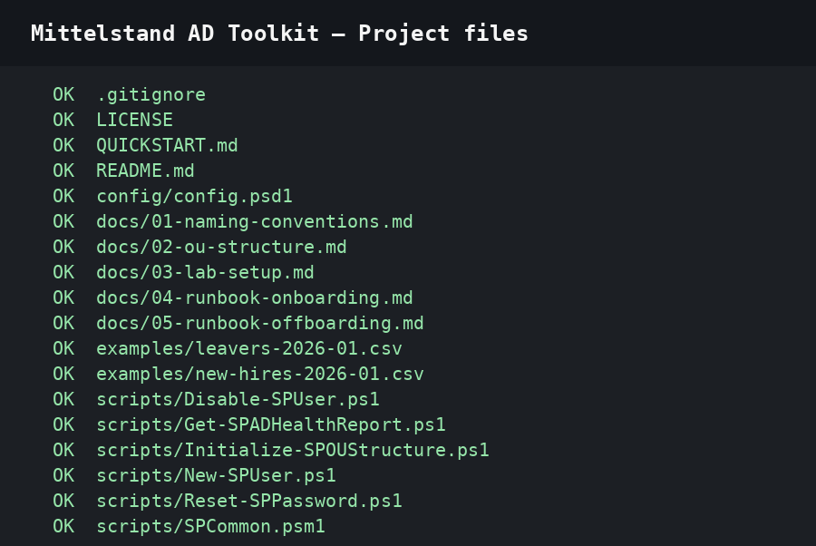
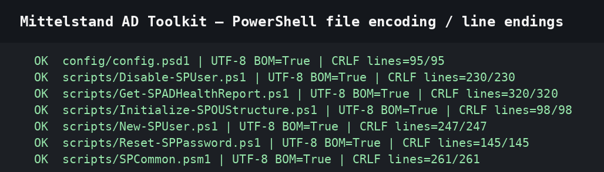
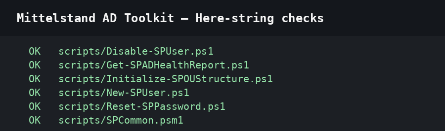
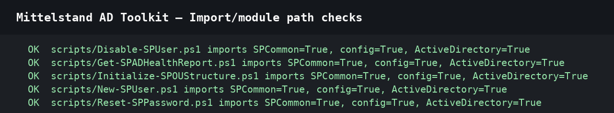
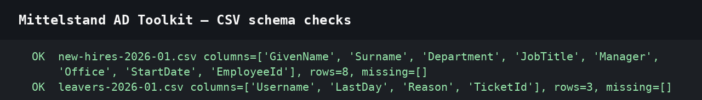
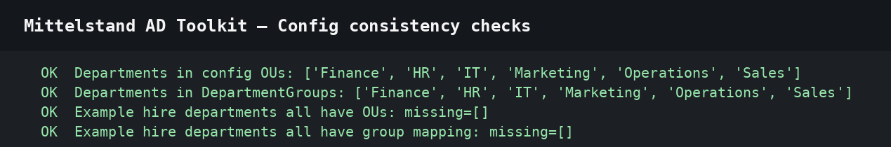
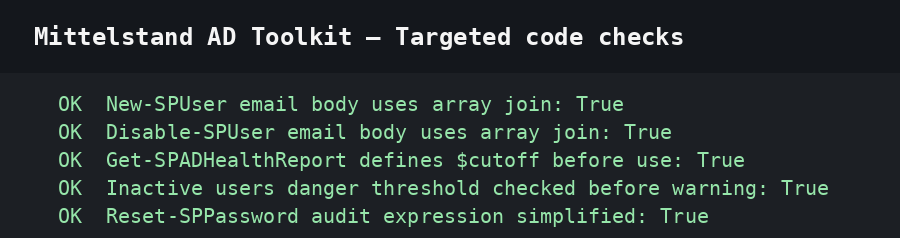
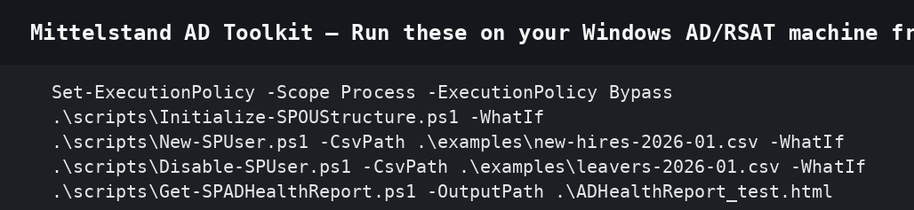

# Mittelstand AD Toolkit

> A practical Active Directory management toolkit for a small-to-medium German company (50–200 users).
> Eine praktische Active Directory-Verwaltungs-Toolkit für mittelständische deutsche Unternehmen.

[]()
[]()
[]()

## 📋 Overview

This toolkit was built to solve real problems faced by IT administrators in German Mittelstand companies:

- **Inconsistent user provisioning** → bulk CSV-driven onboarding with strict naming conventions
- **Sloppy offboarding** (a major DSGVO/GDPR risk) → standardized, auditable disable workflow
- **No visibility into AD health** → weekly automated HTML reports
- **Slow password resets at the helpdesk** → ticket-tracked, logged reset workflow

All scripts are designed for the fictional company **Schmidt & Partner GmbH** but use a `config.psd1` file so you can rebrand them in 30 seconds.

## 🏗️ Project Structure

```
mittelstand-ad-toolkit/
├── scripts/
│   ├── New-SPUser.ps1              # Onboarding: bulk user creation from CSV
│   ├── Disable-SPUser.ps1          # Offboarding: standardized disable workflow
│   ├── Get-SPADHealthReport.ps1    # Weekly HTML health report
│   ├── Reset-SPPassword.ps1        # Helpdesk password reset with logging
│   ├── Initialize-SPOUStructure.ps1 # OU structure bootstrap
│   └── SPCommon.psm1               # Shared functions (logging, config, email)
├── config/
│   └── config.psd1                 # Central configuration
├── docs/
│   ├── 01-naming-conventions.md
│   ├── 02-ou-structure.md
│   ├── 03-lab-setup.md
│   ├── 04-runbook-onboarding.md
│   └── 05-runbook-offboarding.md
├── examples/
│   ├── new-hires-2026-01.csv
│   └── leavers-2026-01.csv
├── screenshots/                    # Demo screenshots from the lab run
├── QUICKSTART.md                   # 30-minute setup guide
└── README.md

```
## 📸 Screenshots

Real screenshots from running the toolkit against a Windows Server 2022 lab domain (schmidt-partner.local).

**Project Files**



**Powershell File Encoding Line Endings**



**Here String Checks**



**Import Module Path Checks**



**Csv Schema Checks**



**Config Consistency Checks**



**Targeted Code Checks**



**Run These On Your Windows Ad Rsat Machine From The Project Root**




## 🚀 Quick Start

1. **Set up a test lab** — see [docs/03-lab-setup.md](docs/03-lab-setup.md). You need:
   - 1× Windows Server 2019/2022 VM as Domain Controller
   - Domain: `schmidt-partner.local`
   - PowerShell 5.1+ with the `ActiveDirectory` module

2. **Edit the config file** — `config/config.psd1` has all paths, OUs, and SMTP settings.

3. **Bootstrap the OU structure**:
   ```powershell
   .\scripts\Initialize-SPOUStructure.ps1
   ```

4. **Run the onboarding script**:
   ```powershell
   .\scripts\New-SPUser.ps1 -CsvPath .\examples\new-hires-2026-01.csv -WhatIf
   ```

5. **Generate a health report**:
   ```powershell
   .\scripts\Get-SPADHealthReport.ps1 -SendEmail
   ```

## 🇩🇪 Why this matters in the German market

- **DSGVO compliance**: every script writes a tamper-evident audit log including who ran it, when, and what changed. Auditors love this.
- **Mittelstand reality**: scripts assume you have *one* admin and *no* fancy IAM tool. They're built for the company that just upgraded from Windows Server 2012R2.
- **Documentation in DE + EN**: SOPs are bilingual because half of German IT teams have international colleagues.

## 📜 License

MIT — use, modify, and put it on your CV.

## 👤 Author

Built as a portfolio project to demonstrate Windows / AD administration skills for IT roles in Germany.
